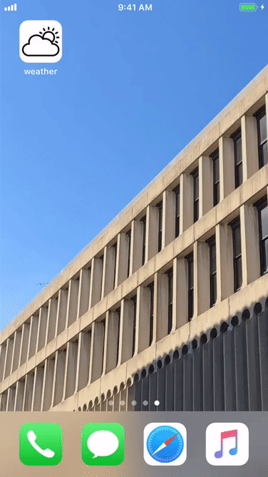

# Weather
## Task

Test task. Create an app using weather API.

## Technologies
Project is created with:

* iOS 11+
* Swift 5
* Alamofire 4.8.2
* CocoaPods dependency manager
* OpenWeather Map API
* CoreLocation

## Solution description

The app loads weather data from OpenWeather Map API, proccesses it and fills current weather field and Forecast TableView.

## How to use

Clone or download project from github. Open weather.xcworkspace and run it on your iPhone.

## Demo

## About

My name is Vlad, iOS developer based in Kyiv. Feel free to contact me for hiring or collabration. Contact email: vladyslavkolomiets@gmail.com
